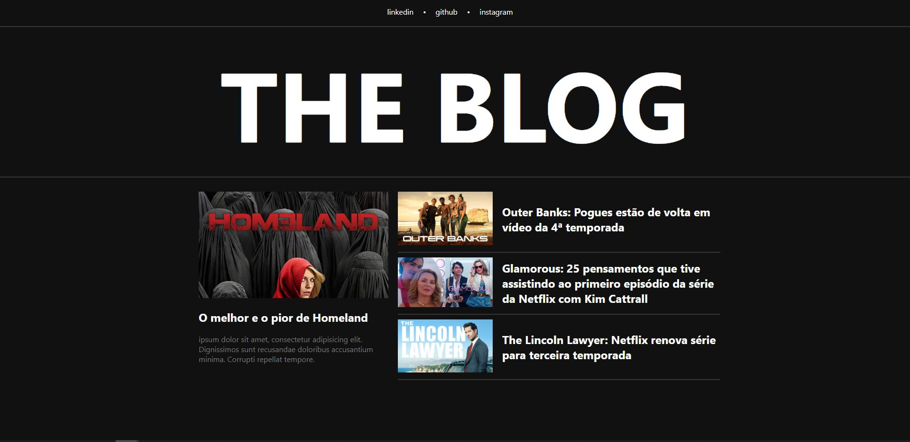
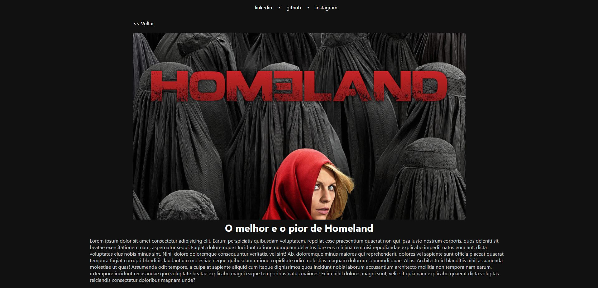

# Blog de Séries - Estudo de Angular

Bem-vindo ao Blog de Séries, um projeto de estudo de Angular! Este é um blog dedicado a séries de TV, desenvolvido como parte de um estudo sobre Angular. Neste projeto, você encontrará uma experiência responsiva e recursos interessantes.

## Sobre o Blog

Este blog foi criado como parte de um estudo de Angular e é uma demonstração de conceitos e habilidades de desenvolvimento web. Embora as informações aqui apresentadas sejam em "Lorem Ipsum", você pode explorar a estrutura do site, a responsividade e outros recursos do Angular.

## Layout Blog Desktop

## Layout Mobile

## Recursos

- **Responsividade**: Este blog é totalmente responsivo e se adapta a diferentes tamanhos de tela, garantindo uma experiência de usuário consistente.

- **Página de Artigos**: Apesar de os artigos atualmente estarem em "Lorem Ipsum", a página de artigos demonstra como os conteúdos podem ser apresentados e acessados.

Obrigado por visitar o Blog de Séries. Esta é uma demonstração do meu trabalho em desenvolvimento web com Angular, e espero que você aprecie a experiência e a responsividade oferecida.
